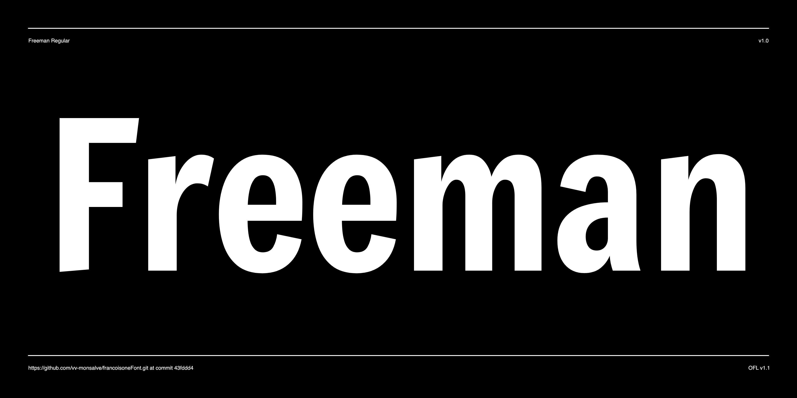

# Freeman Font Project
by Rodrigo Fuenzalida

Freeman is a re interpretation of traditional sans serif gothic display typeface, based on the work done by Vernon Adams on Francoise One and expanding upon it, some elements of the handwitten style are added to give a bit more of personality to the design. Besides that counters have been opened up a little and the stems optimised for use as bold display font in modern web browsers. Slanted stem terminals have been added to give the face added visual play, most of these upgrades plus a tighter spacing where the result of the work during the Summer of Type. After that most of the work consisted in updating the character set to give full SSA African support to the font. 



This project is a fork from the old Google font repository.

# Completed tasks:
- Converted project files to .glyphs
- Fixed tasks listed in [ProjectChecklist.md](https://github.com/googlefonts/gf-docs/blob/master/ProjectChecklist.md) and internal planning spreadsheet.
- Corrected OpenType features
- Changed upm from 2048 to 1000
- Revision of glyphs, anchors and components.
- Extended set to cover African Latin alphabets.

# Freeman changes from Francois One:
- Lowercase characters have a different encounter between stems and curves.
- Changed some proportions to make them more even.
- Revised curves smoothness, weights distribution and characters drawings.
- Bigger counters for better readability at smaller sizes. Most of the changes seemed to be focused on this, improve readability.

## Building the Fonts

The font is built using fontmake and gftools post processing script. Tools are all python based, so it must be previously installed.

To install all the Python tools into a virtualenv, do the following:

From terminal:

```
cd your/local/project/directory
```

Once in the project folder create a virtual environment. 
This step has to be done just once, the first time:

```
python3 -m venv venv
```

Activate the virtual environment
This step should be done each time you will work on the project

```
source venv/bin/activate
```

Install the required dependencies

```
pip install -r requirements.txt

```

Then run the build script in the terminal:

```
cd sources
gftools builder config.yml
```
